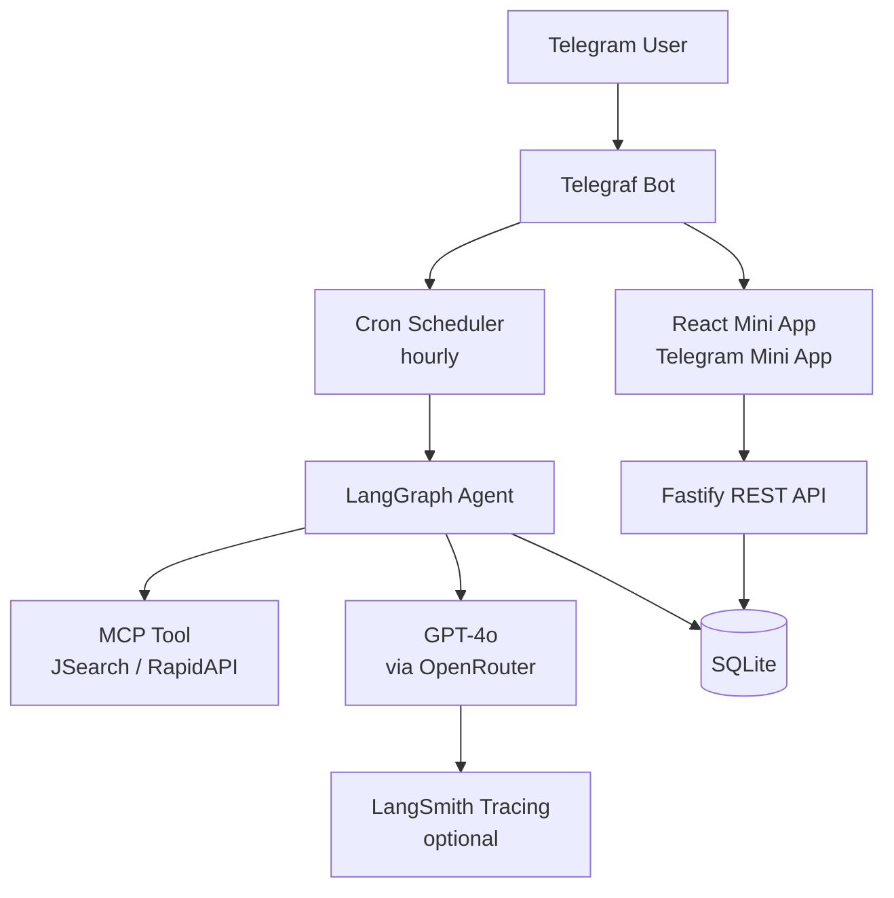
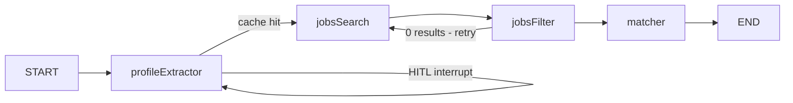
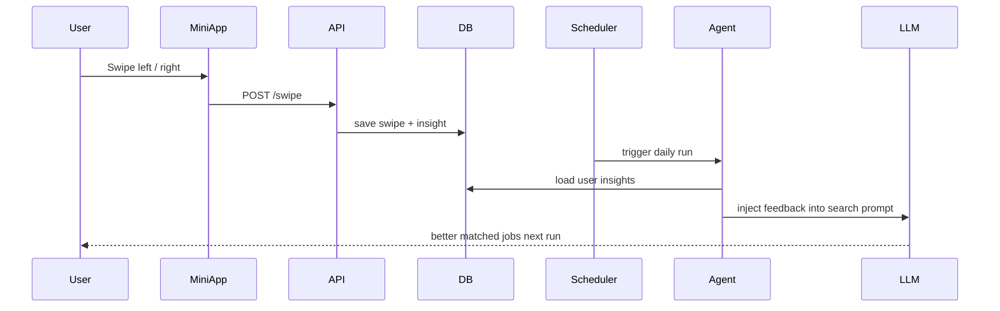

# swipe-to-hire

**Personal AI headhunter — a fully automated job-search pipeline delivered via Telegram.**

Parses your CV, runs a multi-step LangGraph agent to search and score jobs via MCP tool calling, and delivers matched listings as swipeable cards in a Telegram Mini App. Learns from your swipes.

---

## Architecture



---

## LangGraph Pipeline



| Node | Role | Model |
|---|---|---|
| `profileExtractor` | Parses CV PDF via URL, extracts structured profile. SHA-256 cache avoids re-parsing. HITL `interrupt()` for missing fields. | `gpt-4o` |
| `jobsSearch` | Plans 3–4 diverse search queries, calls JSearch via **MCP tool calling**, deduplicates | `gpt-4o` |
| `jobsFilter` | Removes hard blockers (clearance required, wrong domain), respects user prefs | `gpt-4o` |
| `matcher` | Scores jobs 0–100 against profile, writes `agentNotes`, flags `needsHumanReview` | `gpt-4o` (temp 0.3) |

---

## Feedback Loop



---

## Stack

| Layer | Technology |
|---|---|
| AI orchestration | **LangGraph** + **LangChain** |
| LLM | **GPT-4o** via **OpenRouter** |
| Job search | **RapidAPI JSearch** via **MCP tool calling** |
| Backend | **Node.js 22** + **TypeScript** + **Fastify** |
| Bot | **Telegraf** |
| Frontend | **React 19** + **Vite** + **Telegram Mini App SDK** |
| Database | **SQLite** (`better-sqlite3`) |
| Scheduler | `node-cron` |
| Containers | **Docker Compose** |
| Deploy target | **Raspberry Pi** (arm64) |
| Tracing | **LangSmith** (optional) |
| Monorepo | `npm workspaces` |

---

## Project Structure

```
packages/
├── agent/       # LangGraph pipeline (profileExtractor → search → filter → matcher)
├── bot/         # Telegraf bot + Fastify REST API + cron scheduler
├── miniapp/     # React Telegram Mini App (swipe UI, liked jobs, settings)
├── types/       # Shared TypeScript interfaces
└── cli/         # Local dev runner (CLI trigger for the graph)
scripts/
├── release.js   # Version bump + build + SSH deploy to RPi
└── rpi-setup.sh # First-time RPi bootstrap
```

---

## Quick Start

### Local development

```bash
# 1. Install dependencies
npm install

# 2. Copy and fill env
cp .env.example .env

# 3. Start bot + API (watches for changes)
npm run dev

# 4. Start Mini App (separate terminal)
npm run build:miniapp
```

### Deploy to Raspberry Pi

**First time:**
```bash
# Set your RPi SSH target if different from default
export RPI_HOST=pi@raspberrypi.local
export RPI_DIR=/home/pi/swipe-to-hire

bash scripts/rpi-setup.sh
```

**Subsequent deploys:**
```bash
npm run release         # patch bump + build + push + SSH deploy
npm run release:minor   # minor bump
npm run release:major   # major bump
```

The release script:
1. Guards against uncommitted changes
2. Bumps version in `package.json`
3. Builds Mini App
4. Commits + tags + pushes
5. SSHs into RPi → `git pull && docker-compose up -d --build bot`

**Manual RPi update (no version bump):**
```bash
ssh pi@raspberrypi.local "cd /home/pi/swipe-to-hire && git pull && docker-compose up -d --build"
```

---

## Environment Variables

See [`.env.example`](.env.example) for all variables.

| Variable | Required | Description |
|---|---|---|
| `BOT_TOKEN` | Yes | Telegram bot token from @BotFather |
| `OPENROUTER_API_KEY` | Yes | OpenRouter API key (`sk-or-...`) |
| `RAPIDAPI_KEY` | Yes | RapidAPI key for JSearch |
| `WEBAPP_URL` | Yes | Mini App URL (ngrok for dev, public URL for prod) |
| `DB_PATH` | No | SQLite path, default: `.swipe-to-hire.db` |
| `API_PORT` | No | Fastify port, default: `3421` |
| `LANGSMITH_API_KEY` | No | LangSmith tracing |

---

## Tests

```bash
npm test                # unit tests
npm run test:integration  # integration tests (requires real API keys)
npm run test:all          # all
```

---

## License

MIT
